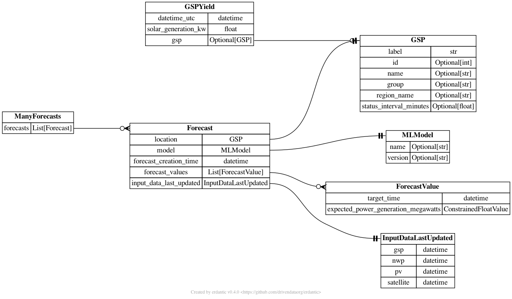
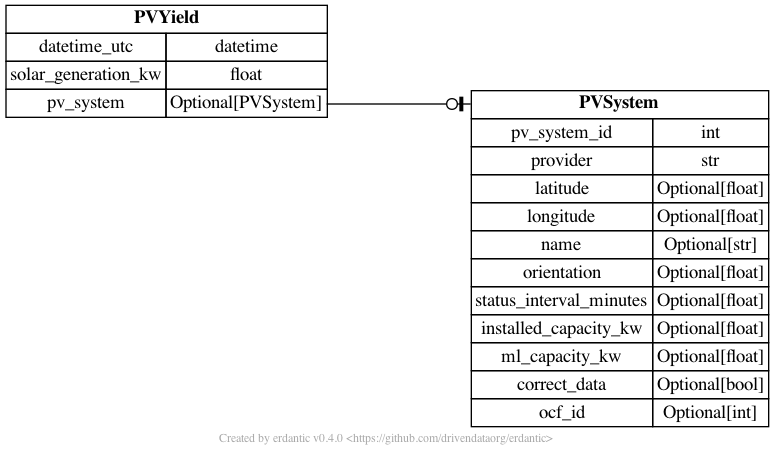

# nowcasting_datamodel
Datamodel for the nowcasting project


The data model has been made using `sqlalchemy` with a mirrored model in `pydantic`.

⚠️ Database tables are currently made automatically,
but in the future there should be a migration process

Future: The data model could be moved, to be a more modular solution.

## nowcasting_datamodel

### models.py
All models are in `nowcasting_datamodel.models.py`.
The diagram below shows how the different tables are connected.




### connection.py

`nowcasting_datamodel.connection.py` contains a connection class which can be used to make a sqlalchemy session.
```python
from nowcasting_datamodel.connection import DatabaseConnection

# make connection object
db_connection = DatabaseConnection(url='sqlite:///test.db')

# make sessions
with db_connection.get_session() as session:

    # do something with the database
    pass
```

### 👓 read.py

`nowcasting_datamodel.read.py` contains functions to read the database.
The idea is that these are easy to use functions that query the database in an efficient and easy way.

 - get_latest_forecast: Get the latest `Forecast` for a specific GSP.
 - get_all_gsp_ids_latest_forecast: Get the latest `Forecast` for all GSPs.
 - get_forecast_values: Gets the latest `ForecastValue` for a specific GSP
 - get_latest_national_forecast: Returns the latest national forecast
 - get_location: Gets a `Location` object

```python
from nowcasting_datamodel.connection import DatabaseConnection
from nowcasting_datamodel.read import get_latest_forecast

# make connection object
db_connection = DatabaseConnection(url='sqlite:///test.db')

# make sessions
with db_connection.get_session() as session:
    f = get_latest_forecast(session=session, gsp_id=1)
```

### 💾 save.py
`nowcasting_datamodel.save.py` has one functions to save a list of `Forecast` to the database

### 🇬🇧 national.py
`nowcasting_datamodel.fake.py` has a useful function for adding up forecasts for all GSPs into a national Forecast.

### fake.py
`nowcasting_datamodel.fake.py`

Functions used to make fake model data.


## 🩺 Testing

Tests are run by using the following command
```bash
docker-compose -f test-docker-compose.yml run tests
```

These sets up `postgres` in a docker container and runs the tests in another docker container.
This slightly more complicated testing framework is needed (compared to running `pytest`)
as some queries can not be fully tested on a `sqlite` database

## 🛠️ infrastructure

`.github/workflows` contains a number of CI actions
1. linters.yaml: Runs linting checks on the code
2. release.yaml: Make and pushes docker files on a new code release
3. test-docker.yaml': Runs tests on every push

The docker file is in the folder `infrastructure/docker/`

The version is bumped automatically for any push to `main`.

## Environmental Variables

- DB_URL: The database url which the forecasts will be saved too
